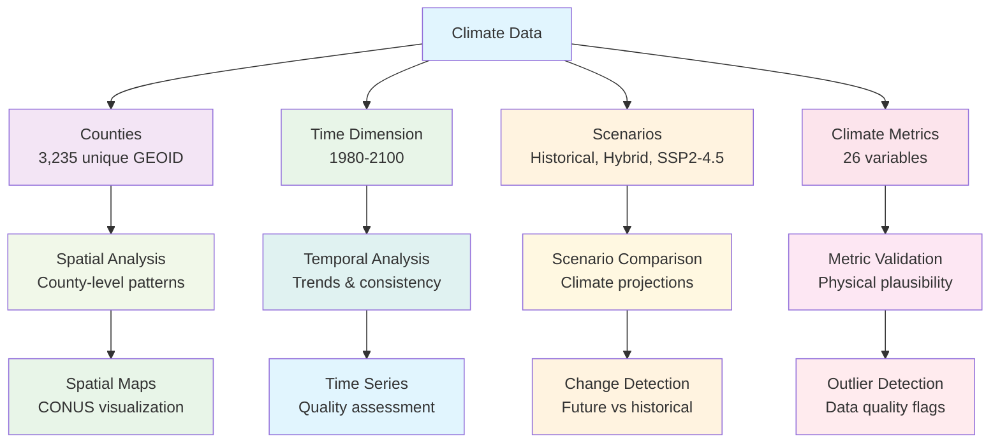

# Climate Data QA/QC Validation and Analysis Suite

A comprehensive toolkit for quality assurance, quality control, and visualization of county-level climate datasets organized by time periods and scenarios.

## Features

- **Comprehensive QA/QC validation** for temporal and spatial consistency
- **Advanced visualization suite** with statistical plots and analysis
- **Spatial mapping capabilities** using county shapefiles for CONUS visualization
- **Precipitation relationships investigation** for identifying data quality issues
- **Spatial outliers analysis** for detecting counties with extreme climate patterns
- **Interactive analysis** with detailed county profiles and trend analysis

## Dataset Structure



## Requirements

### Core Dependencies
- Python 3.8+
- pandas >= 2.0.0
- numpy >= 1.24.0
- matplotlib >= 3.7.0
- seaborn >= 0.12.0
- scipy >= 1.10.0

### Geospatial Dependencies (for mapping)
- geopandas >= 0.13.0
- folium >= 0.14.0
- contextily >= 1.4.0

Install all dependencies:
```bash
uv pip install -r requirements.txt
```

## Scripts Overview

### 1. Climate QA/QC Validator (`climate_qaqc_validator.py`)
Comprehensive validation suite checking:
- **Data completeness** - Missing values, duplicates, temporal gaps
- **Spatial consistency** - County coverage, geographic outliers
- **Temporal consistency** - Unrealistic year-to-year changes, monotonic trends
- **Logical relationships** - Variable interdependencies, physical constraints
- **Physical plausibility** - Realistic value ranges for climate metrics

**Output**: Quality assessment reports, validation plots, issue summaries

### 2. Climate Visualization Suite (`climate_visualization.py`)
Advanced visualization toolkit featuring:
- **Overview dashboard** - Data completeness, distributions, trends
- **Temperature analysis** - Correlations, ranges, extreme events, decadal patterns
- **Precipitation analysis** - Distributions, seasonal patterns, extremes
- **Spatial analysis** - Geographic patterns, county data coverage
- **Scenario comparison** - Climate projection differences
- **Temporal patterns** - Time series analysis, data gaps
- **Spatial maps** - County-level choropleth maps for CONUS
  - Current climate conditions (temperature, precipitation, extreme events)
  - Climate change projections (future vs historical)
  - Data coverage and quality assessment

**Output**: 10+ visualization files including interactive spatial maps

### 3. Precipitation Investigation (`precipitation_investigation.py`)
Focused analysis of precipitation data inconsistencies:
- **Relationship validation** - Precipitation vs high precipitation days
- **Problem pattern identification** - Unrealistic ratios, physical limits
- **Geographic analysis** - Counties with persistent issues
- **Temporal investigation** - Problem trends over time
- **Diagnostic plots** - Scatter plots, distributions, county comparisons

**Output**: Diagnostic plots, problem records CSV, detailed investigation report

### 4. Spatial Outliers Analysis (`spatial_outliers_analysis.py`)
Detection and analysis of counties with extreme climate patterns:
- **Outlier detection** - IQR method with configurable thresholds
- **Persistent outlier identification** - Counties outliers across multiple metrics
- **Geographic clustering** - Spatial patterns of extreme values
- **County profiling** - Detailed analysis of top outlier counties
- **Severity assessment** - Classification of outlier intensity
- **Spatial mapping** - Visual representation of outlier distributions
  - County-level outlier maps
  - Metric-specific outlier patterns
  - Extreme vs moderate outlier classification

**Output**: Spatial maps, county profiles, outlier classification reports

## Spatial Mapping Features

### County Shapefile Integration
- Uses US Census Bureau county boundaries (`tl_2024_us_county.shp`)
- Filters to Continental US (CONUS) - excludes Alaska, Hawaii, territories
- Proper GEOID formatting (5-character zero-padded strings)
- High-resolution county-level visualization

### Map Types Generated
1. **Current Climate Maps** - Average conditions 2015-2020
   - Annual mean temperature
   - Annual precipitation
   - Hot days (>30°C)
   - Cold days (<0°C)

2. **Climate Change Projection Maps**
   - Temperature change (2050-2080 vs 1980-2014)
   - Precipitation change (2050-2080 vs 1980-2014)

3. **Data Coverage Maps**
   - Total records per county
   - Temporal coverage span
   - Available scenarios

4. **Outlier Distribution Maps**
   - Counties by outlier metric count
   - Total outlier occurrences
   - Metric-specific outlier patterns
   - Extreme vs moderate outlier classification

## Usage

### Quick Start
```bash
# Run complete QA/QC validation
python climate_qaqc_validator.py

# Generate all visualizations including spatial maps
python climate_visualization.py

# Investigate precipitation data issues
python precipitation_investigation.py

# Analyze spatial outliers with mapping
python spatial_outliers_analysis.py
```

### Data Requirements
- **Climate data file**: `county_climate_metrics_complete_1980_2100.csv`
- **County shapefile**: `tl_2024_us_county/tl_2024_us_county.shp` (with associated files)
- **Required columns**: GEOID (county identifier), year, scenario, climate metrics

### Expected Data Format
```
GEOID,year,scenario,annual_mean_temp_c,annual_precipitation_mm,...
01001,1980,historical,15.2,1200.5,...
01001,1981,historical,14.8,1150.2,...
```

## Output Directories

- `qaqc_plots/` - QA/QC validation charts and summaries
- `climate_visualizations/` - Comprehensive visualization suite including spatial maps
- `precipitation_investigation/` - Precipitation analysis diagnostics
- `spatial_outliers_analysis/` - Outlier detection results and spatial maps

## Key Features

### Quality Assurance
- Automated validation of 26 climate metrics
- Detection of 4 main categories of data quality issues
- Comprehensive reporting with actionable recommendations
- Expected CONUS county count validation (3,109 counties)

### Spatial Analysis
- County-level geographic analysis for Continental US
- Interactive choropleth maps with proper projections
- Outlier detection with configurable IQR thresholds
- Geographic clustering analysis of extreme values

### Climate Metrics Supported
- Temperature metrics (mean, min, max, extremes)
- Precipitation metrics (annual, seasonal, extremes)
- Derived metrics (growing degree days, extreme event days)
- Scenario-specific projections (historical, hybrid, SSP2-4.5)

### Visualization Quality
- High-resolution outputs (300 DPI)
- Professional styling with clear legends
- Comprehensive dashboards with multiple plot types
- Color-blind friendly palettes where applicable

## Configuration

Scripts use sensible defaults but can be customized:
- Outlier detection thresholds
- Time periods for analysis
- Geographic filtering options
- Visualization styling parameters

## Logging

All scripts generate detailed logs:
- `climate_qaqc.log`
- `climate_visualization.log`
- `precipitation_investigation.log`
- `spatial_outliers_analysis.log`

## Performance Notes

- Processing ~390k records across 3,235 counties
- Spatial operations optimized for CONUS-scale analysis
- Memory-efficient processing with data sampling where appropriate
- Parallel processing for independent visualization generation 